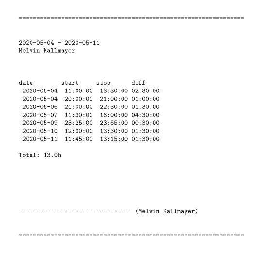

```
USAGE:
  pipopy [-md] INFILE

  where INFILE is a ;-seperated list of format
    
    date;start;stop     [HEADER]
    date1;start1;stop1
    date2;start2;stop2
    .
    .
    .
    dateN;startN;stopN

  holding start and stop times for respective days

OPTIONS:

  -md  enable markdown-friendly output
```

Example output:


